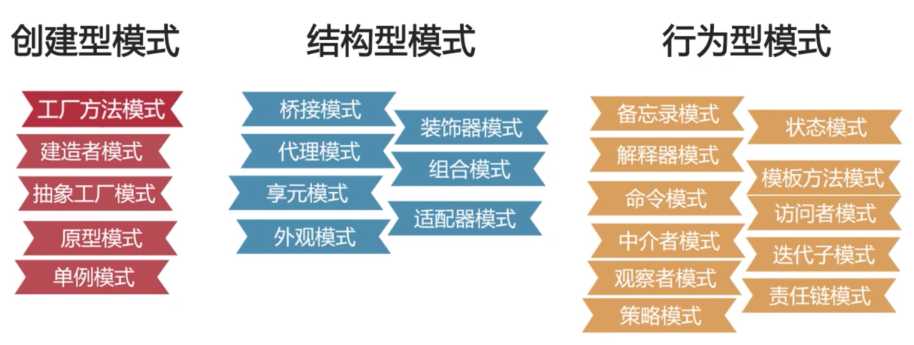

# 什么是设计模式？

* 在软件开发过程中面临的一般问题基于场景的解决方案

* 设计模式的划分
 

# 单例模式

* 目的是使得类的一个对象成为该类系统中的唯一实例
* 定义为一个类有且只有一个实例，并且自动实例化向整个系统提供

1. 要点
* 某个类只能有一个实例
* 必须自行创建实例
* 必须自行向整个系统提供这个实例 

2. 实现
* 只提供私有的构造方法
* 含有一个该类的静态私有对象
* 提供一个静态的公有方法用于创建、获取静态私有对象

3. 实现方案：
* 饿汉式：对象创建过程中实例化
* 懒汉式：静态公有方法中实例化

# 饿汉模式VS懒汉模式

1. 饿汉式的代码实现
```java
// 当类在加载的时，实例已经被创造
// 使用时间比较快
public class SingletonOne{
    // 1.创建类中私有构造
    private SingletonOne(){

    }

    // 2.创造该类型的私有静态实例
    private static SingletonOne instance = new SingletonOne();

    // 3.创建公有静态方法返回静态实例对象
    public static SingletonOne getInstance(){
        return instance
    }
}
```

2. 懒汉式的代码实现
```java
public class SingletonTwo{
    // 1.创建私有构造方法
    private SingletonTwo(){

    }

    // 2.创建静态的该类实例对象
    private static SingletonTwo instance = null;

    // 3.创建公有静态方法提供实例对象
    public static SingletonTwo getInstance(){
        if(instance==null){
            instance = new SingletonTwo();
        }
        return instance;
    }
}
```

3. 懒汉式存在线程风险的问题，可以通过（1）线程锁，（2）双重校验锁，（3）静态内部类或者（4）枚举的方法解决

# 单例模式的特点及适用场景
1. 适用场景
* 创建对象时占用资源过多，但同时又需要用到该类对象
* 对系统内资源要求统一读写，如读写配置信息
* 当多个实例存在可能引起程序逻辑错误，如号码生成器