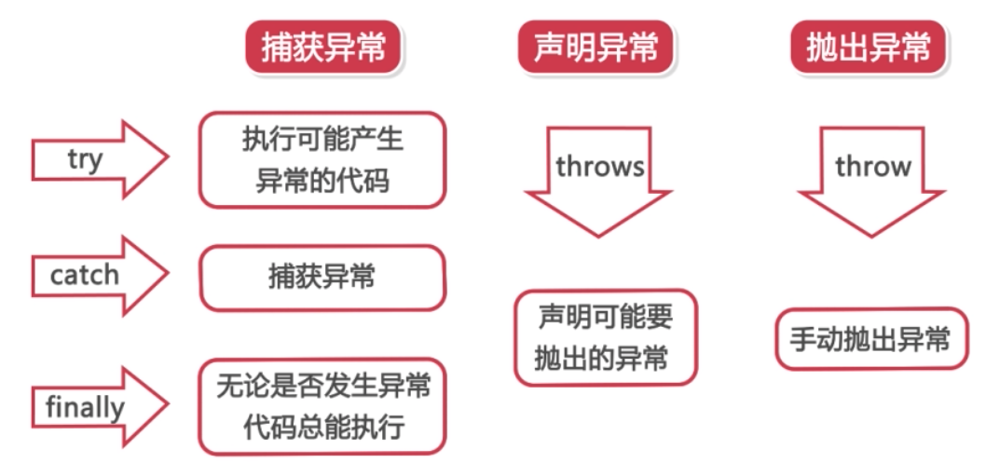

# 异常简介

1. 什么是异常
* 程序上的错误：包括编译期间的错误和运行期间的错误

2. 异常分类
* Error指代程序中无法处理的错误，表示运行应用程序中较严重的问题，比如VirtualMachineError、OutOfMemoryError和ThreadDeath。大多数的错误是不可查的。在编译时不用去担心
* Exception指程序本身可以处理的异常。异常处理通常指针对这种类型异常的处理，比如Checked Exception(IOException、SQLException)和Unchecked Exception(RuntimeException)


# 异常处理简介
1. 异常处理分类
* 异常处理机制为抛出异常和捕抓异常
* 抛出异常：当程序出现错误时，Java会抛出异常对象
* 捕获异常：当抛出异常发生时，程序会自动去寻找合适的处理器
* 对于Checked Exception，必须捕抓或者声明抛出
* 对于Unchecked Exception和Error，在编译时可以不用不住啊或者声明抛出
* 五个关键字：try、catch、finally、throw和throws
 


# 使用try...catch...finally实现异常处理
```java
try{
    // 代码段1
    // 产生异常的代码段
}catch(异常类型 ex){
    // 对异常进行处理的代码段3
}finally{
    // 代码段4
}
```
* try块后面可以接零个或者多个catch块，如果没有catch块，则必须跟一个finally块
```java
try{
    // 代码段1
    // 产生异常的代码段
}catch(Exception ex){
    // 出现的位置比较随机，没有固定位置
    e.printStackTrace();
}finally{
    // 代码段4
}
```

1. 常见异常类型
* ArithmeticException
* NumberFormatException
* ArrayIndexOutOfBoundsException
* NullPointerException
* ClassCastException
* InputMismatchException
* FileNotFoundException

2. 使用多重catch结构处理异常
```java
try{
    // 代码段1
    // 产生异常的代码段
}catch(异常类型 ex1){
    // 对异常进行处理的代码段3
}catch(异常类型 ex2){
    // 对异常进行处理的代码段4
}finally{
    // 代码段5
}
```
* 多层catch结构中不能出现同类型异常
* 父类的Exception块应该放在最后面

3. 终止finally执行的方法
* 使用System.exit()函数

4. return关键字在异常处理中的使用
* 当try块和catch块里面有return关键字时，程序只会返回finally块中的return值


# 使用throw和throws实现异常处理
1. 使用throws抛出异常类型
* throws声明将要抛出何种类型的异常，通过throw将产生的异常抛出
* throws后面可以声明单个或者多个该方法要抛出的异常类型
* 当方法抛出异常列表中的异常时，方法将不对这些类型及其子类类型的异常作处理，而抛向调用该方法的方法，由它去处理
```java
public static int test() throws Exception{}
```
* 在方法中抛出什么异常，调用的方法中就要处理相应的异常
* 当throws中抛出的是Checked Exception时，编译器不会要求你去处理；而当抛出的是Unchecked Exception或者其父类时，编译器会要求你一定要处理

2. 使用throw抛出异常对象
* throw用来抛出一个异常，例如 throw new IOException();
* throw抛出的只能够是可抛出类Throwable或者其子类的实例对象
```java
// 方案一
public void method(){
    try{
        // 代码段1
        throw new 异常类型();
    }catch(异常类型 ex){
        // 对异常进行处理的代码段2
    }
}

// 方案二
public void method() throws 异常类型{
    // 代码段1
    throw new 异常类型();
}
```
* throw关键字可以用来完成一些程序逻辑
```java
public class TryDemoFour {
	public static void main(String[] args) {
		// TODO Auto-generated method stub
		try {
			testAge();
		} catch(Exception e) {
			e.printStackTrace();
		}
	}

	/*
	 * throw抛出异常对象的处理方案：
	 * 1、通过try..catch包含throw语句--自己抛自己处理
	 * 2、通过throws在方法声明出抛出异常类型--谁调用谁处理--调用者可以自己处理，也可以继续上抛
	 *    此时可以抛出与throw对象相同的类型或者其父类
	 */
	// 描述酒店的入住规则：限定年龄，18岁以下，80岁以上的住客必须由亲友陪同
	public static void testAge() {

		try {
			System.out.println("请输入年龄：");
			Scanner input = new Scanner(System.in);
			int age = input.nextInt();
			if (age < 18 || age > 80) {
				throw new Exception("18岁以下，80岁以上的住客必须由亲友陪同");
			} else {
				System.out.println("欢迎入住本酒店");
			}
		} catch (Exception e) {
			// TODO Auto-generated catch block
			e.printStackTrace();
		}
	}
	// public static void testAge() throws HotelAgeException {
	// 	System.out.println("请输入年龄：");
	// 	Scanner input = new Scanner(System.in);
	// 	int age = input.nextInt();
	// 	if (age < 18 || age > 80) {
	// 		//throw new ArithmeticException();
	// 		throw new Exception("18岁以下，80岁以上的住客必须由亲友陪同");
	// 	} else {
	// 		System.out.println("欢迎入住本酒店");
	// 	}
	// }
}
```
* throws只能抛异常或者异常的父类
* 不建议抛出非检查类型的异常


# 自定义异常
* 自定义异常是定义一个类，去继承Throwable类，或者它的子类

```java
public class TryDemoFour {
	public static void main(String[] args) {
		// TODO Auto-generated method stub
		try {
			testAge();
		}catch(HotelAgeException e){
			System.out.println(e.getMessage());
			System.out.println("酒店前台工作人员不允许办理入住登记");
		}catch(Exception e){
			e.printStackTrace();
		}
	}

	/*
	 * throw抛出异常对象的处理方案：
	 * 1、通过try..catch包含throw语句--自己抛自己处理
	 * 2、通过throws在方法声明出抛出异常类型--谁调用谁处理--调用者可以自己处理，也可以继续上抛
	 *    此时可以抛出与throw对象相同的类型或者其父类
	 */
	// 描述酒店的入住规则：限定年龄，18岁以下，80岁以上的住客必须由亲友陪同
	public static void testAge() {

		try {
			System.out.println("请输入年龄：");
			Scanner input = new Scanner(System.in);
			int age = input.nextInt();
			if (age < 18 || age > 80) {
				throw new Exception("18岁以下，80岁以上的住客必须由亲友陪同");
			} else {
				System.out.println("欢迎入住本酒店");
			}
		} catch (Exception e) {
			// TODO Auto-generated catch block
			e.printStackTrace();
		}
	}
	// public static void testAge() throws HotelAgeException {
	// 	System.out.println("请输入年龄：");
	// 	Scanner input = new Scanner(System.in);
	// 	int age = input.nextInt();
	// 	if (age < 18 || age > 80) {
	// 		//throw new ArithmeticException();
	// 		//throw new Exception("18岁以下，80岁以上的住客必须由亲友陪同");
	// 		throw new HotelAgeException();
	// 	} else {
	// 		System.out.println("欢迎入住本酒店");
	// 	}
	// }
}


public class HotelAgeException extends Exception {
	public HotelAgeException(){
		super("18岁以下，80岁以上的住客必须由亲友陪同");
	}
}

class SubException extends HotelAgeException{	
}
```

* throw new Exception(描述信息)适合于临时或者应用频率不高的异常处理情况；而自定义异常类，完成的是通过继承某种已存在异常类型，创建一个独特、结合业务产生的类型，并设置其异常描述信息，适合该异常将在项目中相当频繁出现并应用的场景
* 自定义异常需要先通过throw抛出，才能被捕获，否则无法自动被程序捕获或处理


# 异常链
* 将异常发生的原因一个一个串起来，把底层的异常信息传给上层，这样逐层抛出，即为异常链
* 捕获一个异常后再抛出另一个异常，新抛出的异常会导致异常链前面的异常信息丢失
* 可以通过构造方法或者initCause()保留之前的异常
```java
public class TryDemoFive {

	public static void main(String[] args) {
		// TODO Auto-generated method stub
		try {
			testThree();
		} catch (Exception e) {
			// TODO Auto-generated catch block
			e.printStackTrace();
		}
	}

	public static void testOne() throws HotelAgeException {
		throw new HotelAgeException();
	}

	public static void testTwo() throws Exception {
		try {
			testOne();
		} catch (HotelAgeException e) {
			throw new Exception("我是新产生的异常1",e);
		}
	}

	public static void testThree() throws Exception {
		try {
			testTwo();
		} catch (Exception e) {
			Exception e1=new Exception("我是新产生的异常2");
			e1.initCause(e);
			throw e1;
//			throw new Exception("我是新产生的异常2",e);
		}
	}
}
```
```java
// 另一种方法
public static void methodOne() throws MyException{
    throw new MyException();
}
public static void methodTwo() throws Exception{
    try{
        methodOne();
    }catch(MyException ex){
        throw new Exception("新异常",ex)
    }
}
```