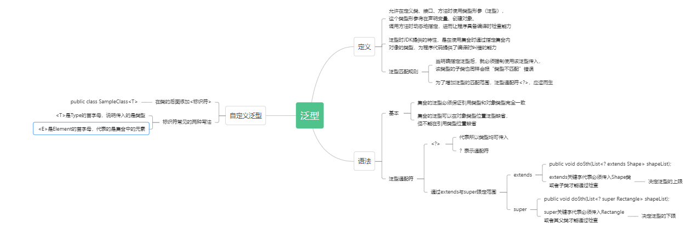

# 泛型

## 什么是泛型

* 允许在定义类、接口、方法时使用类型形参（泛型）。这个类型形参将在声明变量、创建对象、调用方法时动态地指定，进而让程序具备编译时检查能力。
* 泛型是JDK1.5提供的特性，最常见的泛型应用场景便是在使用集合时通过泛型指定集合内对象的类型，为程序代码提供了编译时纠错的能力。

```java
// 定义泛型时要保持一致，不能使用多态
ArrayList<String> bookList = new ArrayList<String>();
bookList.add("三国演义");
bookList.add("水浒传");
// 后面对象中的泛型是可以缺省的
ArrayList<String> bookList = new ArrayList<>();
// 前面的泛型不能缺省
ArrayList<> bookList = new ArrayList<String>();
```

## 自定义泛型及其应用

* 自定义泛型需要在类名后面加"<标识符>"
```java
public class SampleClass<T>{...}
```

1. <T>与<E>的区别

* 标识符字母本身并无强制要求，常见的写法有<T>与<E>两种
* <T>是Type单词的首字母，说明传入的是类型；<E>是Element元素的首字母，代表的是集合中的元素。

2. 泛型的创建与使用
```java
public class CollectionUtils<E>{
    private List<E> data = new ArrayList();
    public void add(E element){
        data.add(element);
    }
    public E randomSelect(){
        int idx = new Random().nextInt(data.size());
        return data.get(idx);
    }
    public static void main(String[] args){
        CollectionUtils<String> utils = new CollectionUtils<String>();
        utils.add("张三");
        utils.add("李四");
        String name = utils.randomSelect();
    }
}
```

3. 泛型方法的应用

* JDK1.5以后提供了泛型方法的支持，允许在类没有声明泛型的前提下让方法独立使用泛型进行开发
```java
public <T> List<T> transferToList(T[] array){}
```
```java
public class PtMethod{
    public <T> List<T> transferToList(T[] array){
        List<T> list = new ArrayList();
        for(T item:array){
            list.add(item);
        }
        return list;
    }
    public static void main(String[] args){
        PtMethod ptMethod = new PtMethod();
        String[] array = new String[]{"A", "B", "C"};
        // 方法在使用时会自动判断数组内的泛型
        List<String> list = ptMethod.transferToList(array);
    }
}
```

4. 泛型通配符简介

```java
// 调用时使用Shape类型是允许的
public void doSth(List<Shape> shapeList);
List<Shape> shapeList = new ArrayList<>;
obj.doSth(shapeList);

// 然而，使用Shape的子类Circle就会报错
List<Circle> circleList = new ArrayList<>;
obj.doSth(circleList);
```

* 当明确指定泛型类型后，就必须强制使用该类型传入，该类型的子类也同样会报“类型不匹配”的错误。为了增加泛型的匹配范围，泛型通配符<?>应运而生
* <?>代表所有类型均可传入
```java
public void doSth(List<?> shapeList);
// 然而，使用Shape的子类Circle不再报错
List<Circle> circleList = new ArrayList<>;
obj.doSth(circleList);
```

* <?>匹配范围过大，会导致传入类型失控，所以需要使用extends关键字代表传入的类型必须是Shape或者其子类
```java
public void doSth(List<? extends Shape> shapeList);
```

* super关键字代表传入的类型必须是Rectangle或者其父类
```java
public void doSth(List<? super Rectangle> shapeList);
```

5. 总结
 

