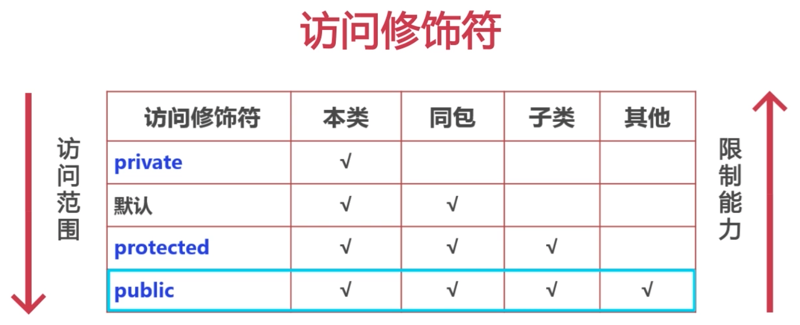

* 继承是一种类和类之间的关系
* 它是使用已存在的类的定义作为基础建立新类
* 新类的定义可以增加新的数据或新的功能，也可以用父类的功能，但不能选择性地继承父类
* 类与类之间的继承关系是通过关键字extends实现的
* 不象python，一个基类可以继承多个父类，java中的子类只能继承一个父类

# 继承的实现
* 子类可以访问父类中的非私有成员

1. 方法的重写
* 方法的重载：两个方法要在同一个类中；方法名相同，参数列表不同（参数顺序不同也代表参数列表不同，但与方法参数名无关）；方法返回值和访问修饰符不作限制。
* 方法的重写要在子类中定义，方法名、参数类型、顺序和个数要与父类完全一致，对参数名不作限制。方法的返回值和访问修饰符可以有变化。
* 重写的方法不能更换返回值类型，但是子类中的返回类型可以是父类返回类型的子类；当父类的返回值类型是void或者基本数据类型时，不允许修改子类的返回值类型；引用数据类型可以修改
* 重写的概念只适用于方法，不适用于属性；对于属性来说，可以在子类中定义和父类同名的属性

2. 访问修饰符的分类及作用
* private:只允许在本类中进行访问
* public:允许在任意位置访问
* protected:允许在当前类、同包子类/非子类、跨包子类调用；跨包非子类不允许
* 默认：允许在当前类、同包子类/非子类调用；跨包子类/非子类不允许调用
 
* 重写方法的访问范围要大于或者等于父类的方法的访问范围

3. super关键字的使用

* super关键字代表的是父类的引用
* 继承的初始化顺序：父类的静态属性 -> 父类的静态代码块 -> 子类的静态属性 -> 子类的静态代码块 -> 父类的构造代码块 -> 父类的无参构造方法 -> 子类的构造代码块 -> 子类的无参构造方法
* 子类构造方法默认调用的是父类的无参构造，所以无参构造方法应该写上
* 在子类中调用父类的双参构造
```java
// 调用父类构造方法
super(name, month);
// 调用父类属性
super.name;
// 调用父类的方法
super.print();
```
* super()的使用和this()的使用方法是一样的

* this关键字和super关键字都不能在静态方法里面使用
* 在同一个构造方法中，this和super关键字不能共用


4. Object类
* Object类式所有类的父类
* 一个类没有使用extends关键字明确标识继承关系，则默认继承Object类（包括数组）
* 官方地址：https://docs.oracle.com/javase/8/docs/api/
* equals()：判断两个对象的引用是否一致
* toString()：打印类的字符串表现形式，结构为类名@对象在内存中位置表现的哈希值。当我们输出对象名的时候，默认调用这个函数；可以重写这个函数，比如String类中，这个函数被重写为字符串内容
* ==比较的是变量存储的值。对于基本数据类型来说，变量存储的是数值；对于引用数据类型来说，变量存储的是对象的内存地址


5. final关键字

* 当类不希望被子类继承的时候，可以在类前添加关键字final。它和public的位置能互换
```java
public final class Cat
```
* 比如System类，是不希望被子类继承的
* final关键字也可以用来修饰方法。被修饰的方法无法被子类重写，但是可以被子类的实例使用
* final修饰的属性无法被修改
* 被final修饰的成员属性只能在构造方法处和构造代码块内赋值，其它地方不可以
* 对于引用数据类型来说，被final修饰后的变量名不能被修改引用，属性值可以根据需要被修改
* 可以根据业务需要，同时使用static和final也修饰某个变量。staic和final的位置可以调整。
* final不能修饰构造方法


6. 注解
* jdk1.5引入的一个特性，可以声明在包、类、属性、方法、局部变量、方法参数等前面，用来对这些元素进行说明和注释
* 注解可以按照运行机制分为源码注解、编译时注解和运行时注解；按照来源分为来自JDK的注解、来自第三方的注解和自己定义的注解
* 元注解是注解的注解
* static和final修饰的父类方法都不能被重写
* 