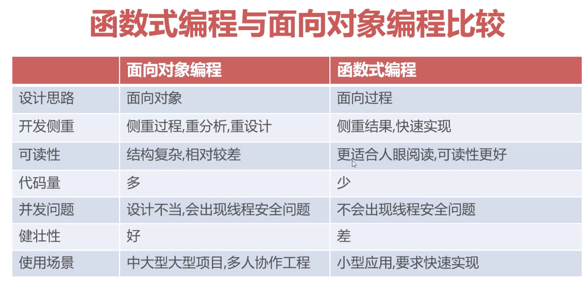
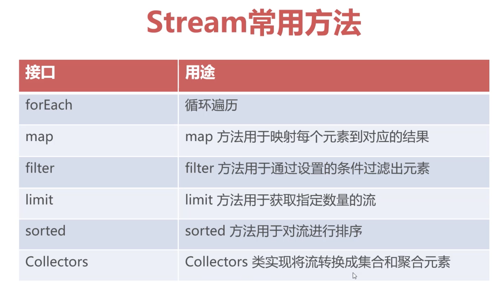

# Lambda介绍

* JDK1.8开始支持Lambda表达式
* 更简洁地实现匿名内部类与函数声明与调用
* 基于Lambda提供stream流式处理极大简化对集合的操作

```java
// 传统代码
List<String> names = Arrays.asList("peter", "anna", "mike");
// 实现集合排序
Collections.sort(names, new Comparator<String>(){
    @Override
    public int compare(String a, String b){
        return b.compareTo(a);
    }
})

// 使用Lambda表达式
Collections.sort(names, (a,b)->b.compareTo(a));
```

1. Lambda表达式语法
* Lambda Operator: (参数列表) -> 实现语句

2. Lambda表达式对接口的要求
* Lambda表达式只能实现有且只有一个的抽象接口，即函数式接口

# 函数式编程

1. 函数式编程
* 基于函数式接口并使用lambda表达的编程方式
* 函数式编程理念是将代码作为可重用数据代入到程序运行中
* 函数式编程强调“你想做什么”，而不是“你想怎么做”

2. 什么是函数式接口
* 有且只有一个抽象方法的接口
* Java拥有大量函数式接口，如java.lang.Runnable
* JDK8后提供了一系列新的函数式接口，位于java.util.function

3. 函数式接口Predicate
* JDK8中新增的函数式接口，位于java.util.function
* 用于测试传入的数据是否满足判断要求
* 需要实现test()方法进行逻辑判断

```java
public static void main(String[] args){
    // 返回的是布尔值
    Predicate<Integer> predicate = n->n>4;
    // return : true
    boolean result = predicatetest(5);

    List<Integer> list = Arrays.asList(1,2,3,4,5,6,7,8,9,10);
    // 筛选奇数
    filter(list, n->n%2==1);
    // 筛选偶数
    filter(list, n->n%2==0);
}

public static void filter(List<Integer> list, Predicate<Integer> predicate){
    for(Integer num:list){
        if(predicate.test(num)){
            System.out.printl(num + " ");
        }
    }
}
```

4. Consumer函数式接口：位于java.util.function包下

* 对应有一个输入参数，但是无输出的功能代码

```java

public static void main(String[] args){
    output(s -> System.out.println("向控制台打印："+s));
    output(s -> {
        System.out.println("向XXX网站发送数据包");
    });
}

public static void output(Consumer<String> consumer){
    String text = "鹅鹅鹅，曲项向天歌，白毛浮绿水，红掌拨清波。";
    // 当程序运行以后，才能决定consumer的行为
    consumer.accept(text);
}
```

5. Function<T,R>
* 对应有一个输入参数且需要返回数据的功能代码

```java
// 利用Function函数式接口生成定长随机字符串
public static void main(String[] args){
    Function<Integer, String> randomStringFunction = l -> {
        String chars = "abcdefghijklmnopqrstuvxwzy0123456789";
        StringBuffer stringBuffer = new StringBuffer();
        Random random = new Random();
        for(int i=0; i<l; i++){
            int p = random.nextInt(chars.length());
            stringBuffer.append(chars.charAt(p));
        }
        return stringBuffer.toString();
    };
    String randomString = randomStringFunction.apply(16);
    System.out.println(randomString);
}
```

6. 函数式接口的注解
```java
@FunctionalInterface
public interface MathOperation{
    public Float operate(Integer a, Integer b);
}
// 不加注解时，可以书写多个抽象方法；
// 加注解后，书写多个抽象方法会报错
```

7. 函数式编程与面向对象编程比较
 


# Stream流

* Stream流式处理是建立在Lambda基础上的多数据处理技术
* Stream对集合数据处理进行高度抽象，极大简化代码量
* Stream可对集合进行迭代、去重、筛选、排序和聚合等一系列处理
```java
//获取集合中最大的偶数
Optional<Integer> op = Arrays.asList(1,2,3,4,5,6)
                             .stream()
                             .filter(x -> x%2 == 0)
                             .sorted((a,b)->b-a)
                             .findFirst();
```
* Stream常用方法
 

1. Stream流的五种创建方法
```java
// 1.基于数组进行创建
String[] arr = {"Lili", "Thomas"};
Stream<String> stream = Stream.of(arr);
stream.forEach(s->System.out.println(s));

// 2.基于集合进行创建
List<String> list = new ArrayList<>();
list.add("lili");
list.add("thomas");
Stream<String> stream = list.stream();
stream.forEach(s->System.out.println(s));

// 3.利用generate方法创建无限长度流
Stream<Integer> stream = Stream.generate(() -> new Random.nextInt(1000000));
stream.limit(10).forEach(s->System.out.println(s));

// 4.基于迭代器创建流
Stream<Integer> stream = Stream.iterate(1, n->n+1);
stream.forEach(s->System.out.println(s));
stream.limit(100).forEach(s->System.out.println(s));

// 5. 基于字符序列创建流
String str = "abcdefg";
IntStream stream = str.chars();
// 输出字符代表的ACII码
stream.forEach(c->System.out.println(c));
stream.forEach(c->System.out.println((char)c));
```

2. Stream的常用方法

```java
// 1.mapToInt：将流中的每个数据转换成整数
List<String> list = Arrays.asList('1', '2', '3', '4', '5');
list.stream()
    .mapToInt(s -> Integer.parseInt(s))
    .filter(n->n%2==0)
    .sum();

// 2.将所有首字母大写
List<String> list = Arrays.asList('lily', 'smith', 'jackson');
list.stream()
    .map(s->s.substring(0,1).toUpperCase()+s.substring(1))
    .forEach(s->System.out.println(s))
    // 将流中的数据转换为List集合，Collectors.toSet()可以转换成集合
    .collect(Collectors.toList());

// 3.将所有奇数按照从大到小排序，且不重复
List<Integer> list = Arrays.asList(1, 2, 3, 4, 5, 6, 7, 8, 9);
list.stream()
    // 去除重复数据
    .distinct()
    .filter(n -> n%2==1)
    .sorted((a,b) -> b-a)
    .collect(Collectors.toList());
```

3. 官方文档

* https://docs.oracle.com/javase/8/docs/api/java/util/stream/Stream.html
