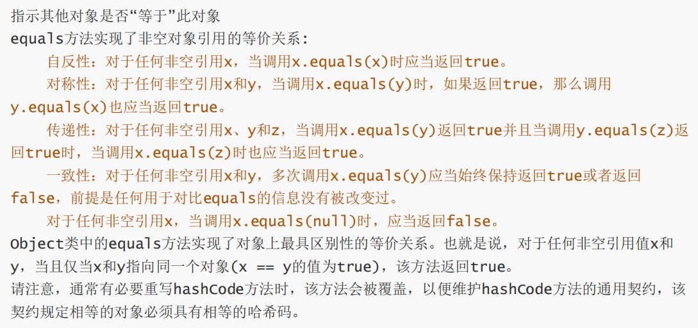

# 集合的应用

* Java集合包含List、Set、Map以及JDK1.5以后推出的Queue四种体系
* Java集合类主要由两个接口派生而出：Collection和Map

1. 四种存储结构
* List代表有序、可重复的集合
* Queue代表队列特性（FIFO）
* Set代表无序、不可重复的集合
* Map代表存储映射关系的集合

2. Collection接口及其实现
 

3. Map接口及其实现
 

## List集合体系及应用

* List集合代表一个元素有序、可重复的集合，集合中每个元素都有其对应的顺序索引
* List集合允许使用重复元素，通过索引访问指定位置的元素
* List集合默认按元素的添加顺序设置元素的索引

1. 接口及类间的关系
  
 * Deque接口是一个双端队列，允许在队首和队尾插入数据

2. ArrayList的特点
* 基于数组实现的List类，是Java数组的有效替代品
* 会自动对容量进行扩容，多数情况下无需指定最大长度
* 数据在内存中是连续紧密存储的，基于数据访问速度快
```java
import java.util.ArrayList;

ArrayList<String> bookList = new ArrayList<String>();
bookList.add("三国演义");
// 如果添加的元素不是范型指定的类型，则编译时会报错
// 范型的作用就是约束数据类型
System.out.println(bookList);
System.out.println(bookList.get(0));
// 在第一个位置插入元素
bookList.add(0, "红楼梦");
// add()访问的是一个布尔值
// set() 替换，返回值是更新之前的原始数据
String before = bookList.set(3, "西游记后传");
// remove()可以传两个参数，一个是删除的数据，另外一个是删除的index，返回值也是布尔值
// 传入的是数据的话，返回的是布尔值；传入的是index的话，返回的是删除的对象
boolean result = bookList.remove("西游记后传");
// size()返回列表中元素的数量
int count = bookList.size();
```

3. add(int, Object)方法常见错误
* 当我们使用这个方法向不连续的位置添加数据时可能会抛出IndexOutOfBoundsException异常，因为ArrayList底层会对元素的下标(index)和当前集合的元素数量(size)进行判断对比，如果下标比元素数量要多，就会认为不合法，从而抛出异常。
* ArrayList底层是由数组决定的，而数组本身是有长度限制的。如果不对用户输入的下标进行验证，那么在实际运行时就会出现数组下标越界的现象。
* 在使用时，我们要先判断int是否超出了范围。

4. LinkedList特征与方法应用
* 同时实现了List与Deque两个接口
* 在保障有序、允许重复的前提下，也可以作为队列在队首、队尾快速追加数据
* 数据在内存中分散存储，基于链表，拥有良好的数据插入速度，但数据访问速度低于ArrayList 
```java
LinkedList<String> bookList = new LinkedList<String>();
bookList.add("三国演义");
bookList.add(0,"红楼梦");
bookList.addFirst("蒸汽革命");
bookList.addLast("黄金时代");
```

5. ArrayList和LinkedList的区别
* ArrayList底层是基于数组的，数据依次连续紧密存储，访问其中元素的速度很快。但是插入数据的速度很慢，因为数组内的元素要依次向后移。
* LinkedList底层是基于双向链表的，在内存中分散存储。遍历数据的时候很慢，但是插入数据的时候很快。

6. 三种集合的遍历方式
```java
List<String> bookList = new ArrayList<String>();
bookList.add("三国演义");
bookList.add("水浒传");
bookList.add("红楼梦");
bookList.add("西游记");
// 1. for循环遍历
for(String book : bookList){
    System.out.println(book);
}
// 2. forEach遍历：基于lambda匿名函数
bookList.forEach(book->{
    System.out.println(book);
});
// 3. iterator遍历
Iterator<String> itr = bookList.iterator();
while(itr.hasNext()){
    String book = itr.next();
    System.out.println(book);
}
```

7. 迭代器的使用“一次性”问题
* 第二次使用迭代器时，无法正确遍历集合，因为在迭代器的内部实现原理中，有一个指针不断向下移动。当这个指针移动之后，无法自动复位。
  
* 如果我们需要再次使用同一个迭代器，则需要另外生成。生成的迭代器不是之前的迭代器，因为它们在内存的地址信息已经不一样了。

## Set集合体系及应用

* 代表元素无序，不可重复的集合
* 与List集合使用方法基本相同，只是处理行为略有不同
* 常用实现类是HashSet与TreeSet
 

1. HashSet
```java
Set<String> mobileSet = new Hashset<String>();
mobileSet.add("12345678912");
mobileSet.add("12345678922");
mobileSet.add("12345678921");
// 显示无序
System.out.println(mobileSet);
// Set不允许出现重复，如果传入的数据已经在Set里面存在，则会返回false。也就是说，add()函数的返回值是boolean
// 应该说，它和List是有一定联系的，重写的函数是同一个
// 返回set的大小
int count = mobileSet.size();
boolean result = mobileSet.contain("12345678921");
// 因为set里面的元素是乱序的，所以无法使用get()方法根据index去获取元素，只能通过遍历的方式去寻找
```

2. Set集合的数据唯一性
* Set集合在新增数据时会先判断数据的hashCode()是否已存在；如果hashCode()已经存在，则会调用equals()进行值比较；只有在二者都存在的情况下，Set集合才会认为数据已存在，不再新增。
* 可以重写hashCode()或者equals()方法，根据自定义的规则去判断数据是否一样，从而确保Set集合的唯一性。
* 当哈希碰撞时（不同的原始数据的哈希值相同），我们需要使用equals()去判断。 

3. HashSet与TreeSet存储原理
* Hashset是Set接口的典型实现，大多数时候使用Set集合时就是使用这个实现类。
* HashSet按Hash算法来决定集合元素的顺序，具有很好的查找性能。
* 当向HashSet集合中存入一个元素时，根据该对象的hashCode值决定该对象在HashSet中的存储位置。

（1） Hash时什么

* Hash是把任意长度的数据通过散列算法变换成固定的输出，该输出就是散列值。HashSet中元素的顺序是根据散列值来排序的。

（2）LinkedHashSet

* LinkedHashSet是HashSet的子类，除HashSet的特性外，它同时使用链表维护元素的次序，可以保障按插入顺序提取数据。
* LinkedHashSet需要维护元素的插入顺序，因此性能略低于HashSet的性能。
* 迭代访问Set里的全部元素时将有很好的性能，因为它以链表来维护内部顺序。
* 与HashSet的对比：双向链表
 

(3) TreeSet

* TreeSet是SortedSet接口的实现类，TreeSet可以确保集合元素处于排序状态。
* 采用红类书的数据结构来存储集合元素。
* 默认采用自然排序队元素升序排列，也可以实现Comparable接口自定义排序方式
 

4. equals方法的重写规范

 
 

5. HashSet与TreeSet的应用

```java
Set<String> mobileSet = new LinkedHashSet<String>();
mobileSet.add("111222333");
mobileSet.add("222333444");
mobileSet.add("333444555");

Set<Integer> mobileSet = new TreeSet<Integer>();
mobileSet.add(100);
mobileSet.add(140);
mobileSet.add(180);
```
```java
// 重写Comparator()接口
class IntegerComparator implements Comparator<Integer>{
    @Override
    public int compare(Integer i1, Integer i2){
        // 降序排列
        return i2-i1;
        // 升序排列
        return i1-i2;
    }
}
// class内部类不能直接用在静态方法中，可以在class前面增加static，或者新加一个方法
public void sort(){
    Set<Integer> mobileSet = new TreeSet<Integer>(new IntegerComparator());
    mobileSet.add(100);
    mobileSet.add(140);
    mobileSet.add(180);
}
```

## Map集合体系及应用

1. Map映射特点
* Map用于保存具有映射关系的数据，每组映射都是key和Value组合而成
* Key与Value可以是任何引用类型数据，但是Key通常是String
* Map中的Key不允许重复，重复为同一个Key设置Value，后者Value会覆盖前者Value


2. HashMap
* Map接口的典型实现类，对Key进行无序存储
* 不能保证数据按存储顺序读取，且Key全局唯一
* Java是先有Map后有Set，HashSet是从HashMap精简而来。HashSet是value为present的HashMap

3. HashMap与LinkedHashMap的区别
```java
// HashMap
import java.util.HashMap;

HashMap<String, Object> student = new HashMap();
student.put("name","张三");
// 相同的key会覆盖内容：put()方法的返回值是覆盖的原始内容中的值
String name = (String) student.put("name","李四");
student.put("age",18);
student.put("height",182);
student.put("weight",60);
// 返回HashMap的大小
student.size();
// 获取某个键的值
student.get("name");
// containsKey()：返回布尔类型，表示key是否存在
student.containsKey("name");
// containsValue()：返回布尔类型，表示value是否存在
student.containsValue(61);
// remove()：参数是key，返回的是key对应的值
student.remove("weight");

// LinkedHashMap：继承自HashMap
LinkedHashMap<String, Object> student = new LinkedHashMap();
student.put("name","张三");
student.put("age",18);
student.put("height",182);
student.put("weight",60);
// LinkedHashMap会按照放入的顺序排列
// 我们也可以使用顶层的接口创建
Map<String, Object> student = new LinkedHashMap();
```

4. Map实现类：TreeMap
* 存储key-value对时，需要根据key对节点进行排序
* TreeMap支持两种key排序：自然排序与定制排序
* 与TreeSet相同，TreeMap也是基于红黑树结构对数据进行排序

```java
// TreeMap是针对key来进行排序和存储的
Map<String,Object> record = new TreeMap<>();
record.put("A1","1");
record.put("C3","2");
record.put("B5","3");
record.put("X1","4");
record.put("C1","5");
// 按照字典顺序进行排序
class RecordComparator implements Comparator<String>{
    @Override
    public int compare(String o1, String o2){
        // 升序
        return o1.compareTo(o2);
        // 降序
        return o2.compareTo(o1);
    }
}
public void sort(){
    Map<String,Object> record = new TreeMap<>(new RecordComparator());
    record.put("A1","1");
    record.put("C3","2");
    record.put("B5","3");
    record.put("X1","4");
    record.put("C1","5");
}
```

5. Map集合的三种遍历方式

```java
Map<String,Object> record = new HashMap<>();
student.put("name","张三");
student.put("age",18);
student.put("height",182);
student.put("weight",60);
// 1. for循环遍历
Set<String> keys = record.keySet();
for(String k:key){
    records.get(k);
}
// 2. forEach循环
record.forEach((key,value)->{
    System.out.print(key + ":" + value);
});
// 3. iterator
Iterator<Map.Entry<String,Object>> itr = record.entrySet().iterator();
while(itr.hasNext()){
    Map.Entry<String,Object> entry = itr.next();
    System.out.prinlnt(entry.getKey() + ":" + entry.getValue());
}
```

## 应用Collections实现集合排序

1. 通过Collections实现List排序
```java
class SampleComparator implements Comparator<Integer>{
    // 如果返回值大于0，则证明i1大于i2，i1和i2调整位置，compare进行升序排列
    // 所以compare总会根据return的值进行排列

    @Override
    public int compare(Integer i1, Integer i2){
        return i1-i2;
    }
}

public List<Integer> sort(List<Integer> list){
    // sort方法对原始的list集合进行调整，默认升序排列
    // 如果要进行降序排列，要使用Comparator接口
    Collections.sort(list);
    // 使用新定义的规则进行排序
    Collections.sort(list, new SampleComparator());
    return list;
}

public static void main(String[] args){
    List<Integer> list = new ArrayList<>{};
    list.add(70);
    list.add(90);
    list.add(30);
    list.add(50);
    ListSorter listSorter = new ListSorter();
    List<Integer> list1 = listSorter.sort(list);
}
```

2. 自定义类型如何集合排序
