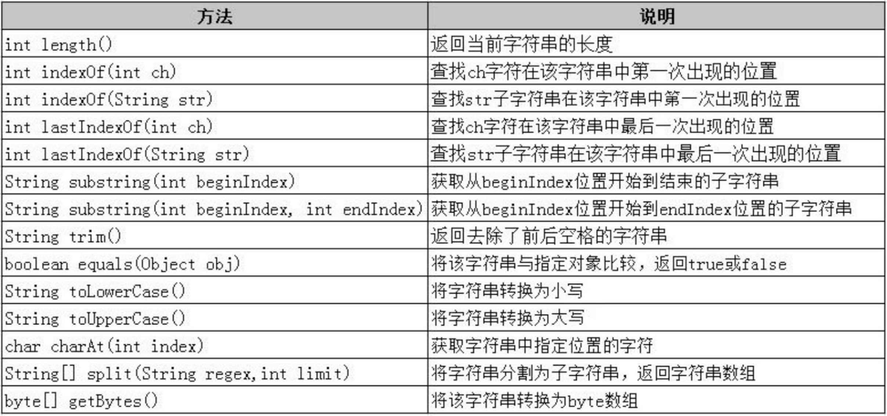
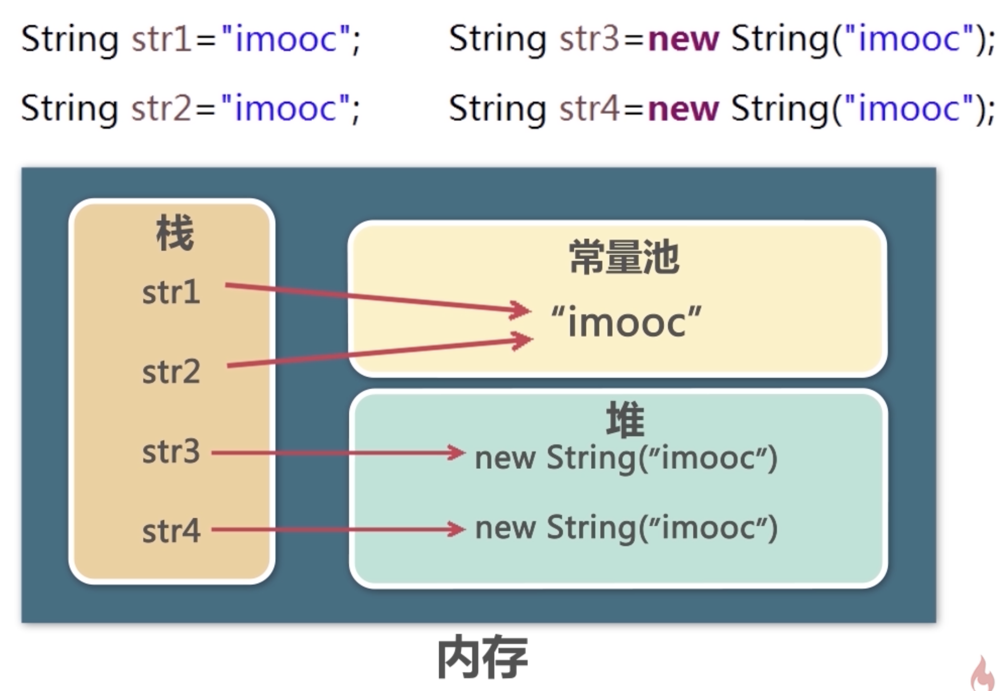
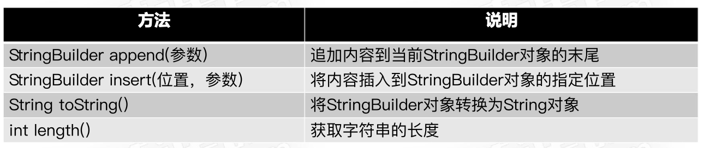

# 字符串

## String类

1. 创建String对象的方法

```java
// 1. 使用字符串常量创建对象
String s1 = "imooc";
// 2. 使用new关键字创建空字符串
String s2 = new String();
// 3. 先去堆中创建一个对象，然后会去常量池中对比。如果常量池中没有，就放一份在常量池中。如果有，则不会往常量池中放
String s3 = new String("imooc");
// 4. 使用字符数组作为参数创建字符串对象
char[] ch = {'i', 'm', 'o', 'o', 'c'}
String s4 = new String(ch);
// 5. 指定使用字符数组中从那个位置（1）开始截取几个元素（2）创建字符串
// s5 = "mo"
char[] ch = {'i', 'm', 'o', 'o', 'c'}
String s5 = new String(ch, 1, 2);
// 6. 使用字节数组生成字符串，用于存储传输的二进制数据
// 字节数组b中存储的是元素的ASCII码值
byte[] b = {54,69,70,71,72};
String s6 = new String(b);
String s7 = new String(b,1,2);
// 可以指定字符集，需要抛出异常UnsupportedEncodingException
String s6 = new String(b,"utf-8");
String s7 = new String(b,1,2, "utf-8");
```

2. 字符串的常用方法
 
* 官网还介绍了其它方法：https://docs.oracle.com/javase/8/docs/api/java/lang/String.html
```java
String str = "JAVA 编程 基础";
// output:10
System.out.println(str.length());
// output:程
System.out.println(str.chatAt(6));
// output:编程 基础
System.out.println(str.substring(5));
// output:编程
System.out.println(str.substring(5,7));
```

```java
String str = new String("JAVA编程基础，我喜欢java编程");
// 返回字符'A'在字符串中第一次出现的位置：1
System.out.println(str.indexOf('A'));
// 返回子串"编程"在字符串中第一次出现的位置：4
System.out.println("子串\"编程\"在字符串中第一次出现的位置："+str.indexOf("编程"));
// 返回字符'A'在字符串中最后一次出现的位置：3
System.out.println(str.lastIndexOf('A'));
// 返回子串"编程"在字符串中最后一次出现的位置：16
System.out.println("子串\"编程\"在字符串中最后一次出现的位置："+str.lastIndexOf("编程"));
// 从字符串index值为8的位置开始，查找子串"编程"在字符串中第一次出现的位置：16
System.out.println("从字符串index值为8的位置开始，查找子串\"编程\"在字符串中第一次出现的位置："+str.indexOf("编程",8));
```

3. 常见问题

（1）String类和Object类中equals()方法的异同

    Object类中equals()相当于==，比较的是内存中的地址，判断是否为同一对象；
    String类对其进行重写，比较的是所指向的对象内容是否相等。

（2）字符串和字节数组转换过程中使用字节编码的问题

    数据在传输时是以二进制的格式进行的，所以需要将字符串转换成字节数组，并且在转换的时候指定编码格式。
    字节用byte类型表示，1个字节是8个二进制位，byte类型表示的范围是-128到128之间的整数。
    如果使用的是GBK字符集，则2个byte类型的数据表示一个汉字；如果使用的是UTF-8字符集，则3个byte类型的数据表示一个汉字。字母和空格还是用一个字节表示。
（3）字符集在工程创建时就需要修改

4. 字符串与byte数组间的相互转换
```java
String str = new String("JAVA 编程 基础");
// 获得二进制字符编码
byte[] arrs = str.getBytes();
// 将字符数组转换成字符串
String str1 = new String(arrs);
```

5. 等于运算符和equals方法的区别
```java
String str1 = "imooc";
String str2 = "imooc";
String str3 = new String("imooc");
// output:true
System.out.println("str1和str2的内容相同？"+str1.equals(str2));
// output:true
System.out.println("str1和str2的内容相同？"+str1.equals(str3));
// output:ture
System.out.println("str1和str2的地址相同？"+str1==str2);
// output:false
System.out.println("str1和str3的地址相同？"+str1==str3);
```
 

6. 字符串String的不可变性
* 字符串一经创建并不可修改。
* 当我们在常量池或者堆中创建一个新的字符串，并把它指向栈中原有的指向名时，字符串并没有发生改变，改变的是“指向”。


## StringBuilder类
 
* String具有不可变形，而StringBuilder不具备；当频繁操作字符串时，使用StringBuilder。
* StringBuilder和StringBuffer基本相似。区别在于后者是线程安全的，而前者没有。所以前者的性能也略高一些。

1. String与StringBuilder的区别及应用场景
* String创建后是不可以修改的，而StringBuilder是可以修改的。
* String比StringBuilder的执行效率要低，因为在运行时产生了一些String对象，这样会耗费一些时间。
* 如果要操作的是少量的字符串，可以使用String，否则使用StringBuilder。

2. 常用方法
 
* 其它方法可以参考官网地址：https://docs.oracle.com/javase/8/docs/api/java/lang/StringBuilder.html
    ```java
    StringBuilder str = new StringBuilder("你好");
    // 添加内容，在堆空间中原有字符串上修改
    str.append(",");
    str.append("imooc!");
    // 可以链式使用
    str.append(",").append("imoooc!");
    
    // 替换“你好，imooc！”中的子串，使其变成“你好，iMOOC!"
    // 1. 先删除，后插入
    str.delete(4,8).insert(4,"MOOC");
    // 2. 使用replace方法直接替换
    str.replace(4,8,"MOOC");
    
    // 还可以使用substring()方法
    str.substring(0,2);
    ```